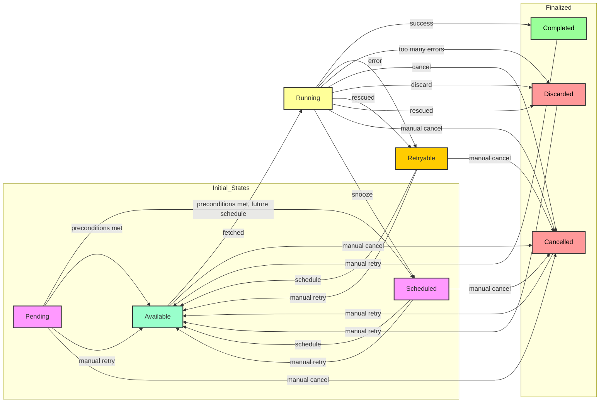

```mermaid
flowchart LR
    %% Define Styles
    classDef waiting fill:#f9f,stroke:#333,stroke-width:2px;
    classDef available fill:#9fc,stroke:#333,stroke-width:2px;
    classDef running fill:#ff9,stroke:#333,stroke-width:2px;
    classDef retryable fill:#ffcc00,stroke:#333,stroke-width:2px;
    classDef final fill:#9f9,stroke:#333,stroke-width:2px,color:black;
    classDef finalFailed fill:#f99,stroke:#333,stroke-width:2px,color:black;
    classDef retryLine stroke-dasharray: 5 5

    %% Apply Styles
    A:::available
    S:::waiting
    P:::waiting
    R:::running
    Re:::retryable
    C:::final
    Ca:::finalFailed
    D:::finalFailed

    %% Define Initial States
    subgraph Initial_States
        A["Available"]
        S["Scheduled"]
        P["Pending"]
    end

    %% Define Intermediate States
    R["Running"]
    Re["Retryable"]

    %% Define Final States
    subgraph Finalized
        C["Completed"]
        Ca["Cancelled"]
        D["Discarded"]
    end


    %% Main Flow
    A -- fetched --> R
    R -- success --> C
    R -- error --> Re
    R -- too many errors --> D

    R -- cancel --> Ca
    R -- discard --> D
    R -- snooze --> S

    Re -- schedule --> A

    S -- schedule --> A

    P -- preconditions met, future schedule --> S
    P -- preconditions met --> A

    %% Rescuer
    R -- rescued --> Re
    R -- rescued --> D

    %% Retry Transitions
    C -- manual retry --> A
    D -- manual retry --> A
    Ca -- manual retry  --> A
    Re -- manual retry --> A
    S -- manual retry --> A
    P -- manual retry --> A

    %% Cancellation Transitions
    A -- manual cancel --> Ca
    R -- manual cancel --> Ca
    S -- manual cancel --> Ca
    P -- manual cancel --> Ca
    Re -- manual cancel  --> Ca

```
